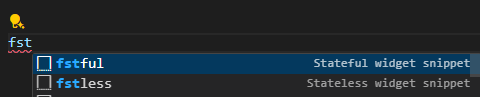

# HW 02 - 臺灣時間格式化
> 主題: Stateless元件、Dart 語法

你將會設計一個人符合臺灣格式的時間顯示元件，叫做`TaiwanTime()`。請仔細依照以下說明進行設計。
- [ ] 1. 請在既有的 `flutter_training` 個人專案中建立一個名為 `hw-02` 的分支並切換到此分支上作業。
- [ ] 2. 請在 `lib` 目錄下建立一個檔案 `widgets/taiwan_time.dart`，並在此檔案中建立一個 StatelessWidget `TaiwanTime`。
    > 如何快速建立一個 widget? 可以善用 snippet，輸入 fstful 後按下 `Tab` 鍵即可建立一個有狀態的 widget，輸入 stless 後按下 `Tab` 鍵即可建立一個無狀態的 widget。
    - 第一個參數 `DateTime time`，代表要顯示的時間，或無提供則預設為當前時間。
    - 第二個參數為 `showFuzzy`，當 `showFuzzy` 為 `true` 時，則會多顯示模糊時間，此參數預設值為 `false`。底下將說明什麼是模糊時間。
- [ ] 3. 設計臺灣時間顯示: 顯示格式為: `民國幾年幾月幾日 早上/下午/晚上/凌晨幾點幾分`，例如: `民國114年3月14日 下午2點33分`，或是 `民國114年3月14日 凌晨0點00分`。使用範例如下:
    ```dart
    TaiwanTime(time: DateTime(2025, 3, 14, 14, 33)),
    // 民國114年3月14日 下午2點33分
    TaiwanTime(time: DateTime(2025, 3, 14, 00, 00)),
    // 民國114年3月14日 凌晨0點00分
    ```
    > 時間分成四個時段: 若時間落在00:00到05:59之間，則顯示為凌晨，06:00到11:59為早上，12:00到17:59為下午，18:00到23:59為晚上。
- [ ] 4. 多顯示模糊的臺灣時間。模糊時間是根據為當前時間與參數時間的**時間差**而產生不同的顯示，規則如下:
    - 時間差 < 5 分鐘，顯示 `剛剛` 或 `即將發生`。
    - 時間差 < 1 小時，顯示 `x 分鐘前` 或 `x 分鐘後`。
    - 時間差 < 24 小時，顯示 `x小時以前`、`x小時以後`。
    - 時間差 < 1 週，顯示 `x 天前` 或 `x 天後`。
    - 時間差 >= 1 週，則不再顯示模糊時間。  
    
    使用範例如下:
    ```dart
    TaiwanTime(time: DateTime(2025, 3, 14, 14, 29), showFuzzy: true),
    // 民國114年3月14日 下午2點30分 (剛剛)
    TaiwanTime(time: DateTime(2025, 3, 15, 19, 00), showFuzzy: true),
    // 民國114年3月15日 晚上7點00分 (1天後)
    TaiwanTime(time: DateTime(2025, 3, 7, 14, 29), showFuzzy: true),
    // 民國114年3月07日 下午2點30分 (7天前)
    TaiwanTime(time: DateTime(2025, 3, 21, 00, 00), showFuzzy: true),
    // 民國114年3月21日 凌晨0點00分 
    ```
    > 如何計算時間差? 請參考 [DateTime.difference](https://api.flutter.dev/flutter/dart-core/DateTime/difference.html)。
- [ ] 5. 自訂樣式: 請新增一個參數叫做 `style`，讓呼叫者可以自訂文字顯示的樣式。使用範例如下:
    ```dart
    TaiwanTime(
        time: DateTime(2025, 3, 24, 22, 33),
        style: TextStyle(
            color: Colors.red,
            fontSize: 20,
        ),
    ),
    // 民國114年3月24日 晚上10點33分
    ```
