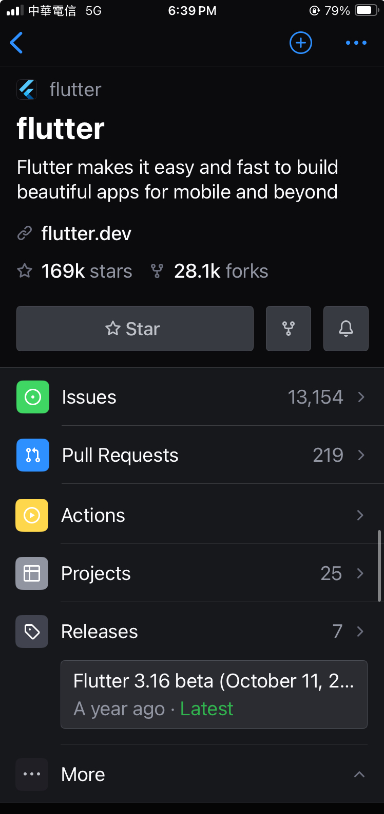

# HW 04 排版模仿練習
> 主題: 排版與樣式應用

接下來的任務請刻出與底下截圖**排版一樣**的畫面。
下圖為GitHub手機版Flutter官方存放庫頁面:

### 說明
- 所謂排版一樣代表每個元素顯示的相對位置、佔據比例、間距、排列順序、對齊需要一致。
- 顏色、字體大小接近即可。Icons 有些 Flutter 預設沒有，所以可以自行選擇合適的 icons 使用即可。Logo的部分可以使用`FlutterLogo` widget。
- 不需要實作功能。(按鈕點擊後不需要有任何反應)。
- 實作方式不限，但僅用到課堂提到的widget就可以達成。(重複使用的widget組合也可以自行建一個打包成一個widget)
- 完成後一樣將更新後的分支`hw-04`推送至個人專案`flutter_training`，並在更新README.MD檔案，將最終結果截圖顯示在`README.MD`檔案中。
    > [如何在GitHub建立與設計README.MD](https://docs.github.com/en/get-started/writing-on-github/getting-started-with-writing-and-formatting-on-github/quickstart-for-writing-on-github)

