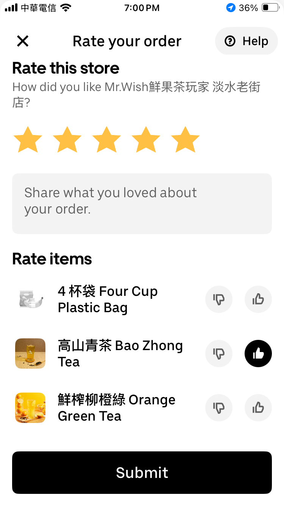
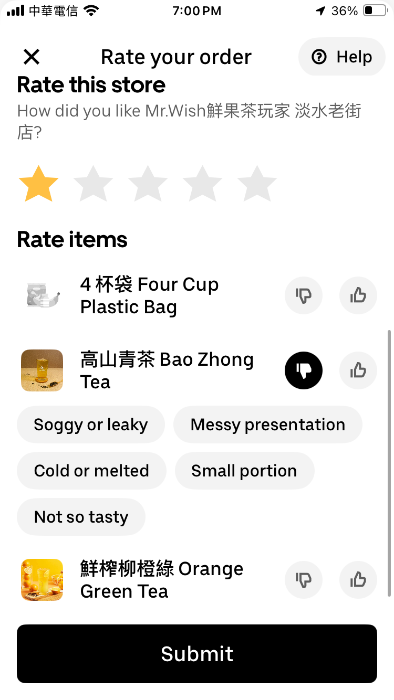

# HW 05 - UberEats評分頁面
您將複製一個UberEats的評分頁面，並加入簡易的狀態。範例結果如下圖:
* 圖一: 評分5顆星與餐點項目按下喜歡的畫面
 
* 圖二: 評分1顆星與餐點項目按下不喜歡的畫面

### 評分依據:
- [ ] (10%) **分支建立**: 在個人的`flutter_training`專案中新增並切換到`hw-05`分支上作業。
    > 由於本次會用到作業二的星星評分元件，您可以選擇以分支`hw-02`為基礎建立新的分支。
- [ ] (10%) **AppBar**: 從左到右分別為離開按鈕、標題、與分享按鈕。(樣式類似即可，排版需一致)
- [ ] (10%) **標題**: 包含一行標題與一行餐廳名稱。
- [ ] (10%) **評分星星**: 顯示五顆星星，點擊後可以改變星星的數量。(請沿用作業二的星星元件)
- [ ] (10%) **留言輸入欄**: 若使用者給五顆星星會顯示留言輸入欄，否則隱藏。
- [ ] (30%) **餐點項目**: 顯示至少三個餐點項目，每個項目需包含:
    - [ ] 1. **餐點圖片**: 顯示餐點的圖片。可以使用任意icons或色塊代替。置左與圓角。
    - [ ] 2. **餐點名稱**: 顯示餐點的名稱。需使用粗體字與佔據剩餘的寬度。需自動換行。
    - [ ] 3. **喜歡與不喜歡按鈕**: 置右顯示。按下後會改變按鈕的顏色。但一次**最多只能有一個按鈕為選取狀態**。
- [ ] (10%) **不喜歡的原因**: 若使用者對餐點按下不喜歡，則在該餐點項目下方顯示至少五個原因供選擇。原因內容可自訂，會自動換行顯示。
- [ ] (10%) **提交按鈕**: 顯示在畫面最底部。點擊後不需要任何動作。
### 備註:
1. 最後一次推送的 commit 結果計分。
2. 樣式雖不在說明中，但請盡量與畫面一致，包含圓角、深淺色、字體樣式接近期可。排版則會需要一致，包含順序、間距、排列等。
3. 若評分依據沒有特別說明，則實作方式不限制。
