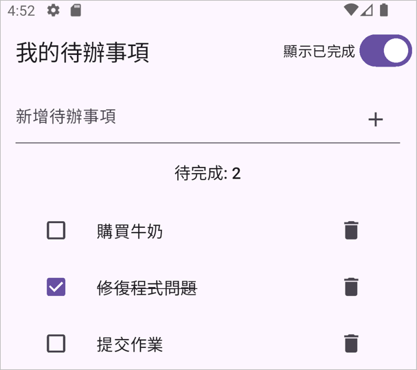

# HW 06 - Todo List
> 概念: 文字欄位、checkbox、按鈕、switch與簡易狀態管理

您將會設計一個簡易但完整的待辦事項畫面 (不需考量到資料的儲存)。範例結果如下圖:

請在個人的`flutter_training`專案中新增並切換到`hw-06`分支上作業。實作與設計架構方式若無特別說明則無限制但必須要支援底下五個功能。
- [ ] 1. 標題: 使用 `AppBar` 顯示文字 `我的待辦事項`。
- [ ] 2. 輸入欄: 輸入待辦事項內容後，按下右方 `+` 符號會清除欄位並新增到下方的列表中。
   > 新增按鈕可透過 `TextField` 中的 `suffixIcon` 屬性設定
- [ ] 3. 待辦事項列表: 顯示所有待辦事項，每一列會包含以下三個元素:
   - [ ] 1. 勾選方塊: 透過 `Checkbox` 設計，用來標記該事項是否已完成。
   - [ ] 2. 待辦事項內容: 顯示待辦事項的文字內容。若事項已完成，文字會變成刪除線。
        > 刪除線可以透過 `Text` 的 `decoration` 屬性設定。名稱為 `TextDecoration.lineThrough`。
   - [ ] 3. 刪除按鈕: 透過 `IconButton` 設計，按下按鈕會刪除該待辦事項。
- [ ] 4. 待完成統計: 顯示目前未完成的待辦事項數量。如 `待完成: 3`。
- [ ] 5. 顯示已完成篩選: 顯示一個 `Switch`，用來篩選是否顯示已完成的待辦事項。
---

> 樣式不在計分範圍內，但請保持整齊與易讀性。
