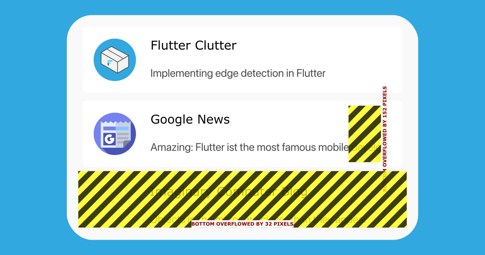

# HW 09 個人專案進度
### Reminders
* 提醒最後專題的發表時間是 **2025/4/25**。進度請參考下表:
  
    | 日期時間              | 課堂     | 理想的專題進度   |
    | --------------------- | -------- | ---------------- |
    | 2025/4/11             | 第10堂課 | 主UI刻劃完成     |
    | 2024/4/12 - 2025/4/17 |          | 功能與UI持續開發 |
    | 2025/4/18             | 第11堂課 | 70-80%功能完成   |
    | 2024/4/18 - 2025/4/25 |          | 測試與除錯       |
    | 2025/4/25             | 第12堂課 | 100%完成能夠發表 |

* 個人專案的存放庫必須認定為公開(public)，設定與新增方式需協助可再提出。
* UI設計時需考量較小尺寸的顯示，為避免產生widget overflow問題:
  * [X] 建議善用滾軸元件(ListView、SingleChildScrollView)來顯示內容而非Column。
  * [X] 在Row跟Column中建議使用Expanded把較大的元件包起來以避免overflow問題。  
  > 以下圖片為例，文字(Amazing: Flutter...)應以Expanded包起來，整個清單(Flutter Clutter, Google News, ...)應以SingleChildScrollView包起來。
    
### 預期的進度表:

> [!TIP]
> 若專題開發時程有壓力，建議簡化專題功能。以實作主要功能為主 (如基本的CRUD)，其他功能可以不實作或簡化。
### 作業內容
請依照個人專題內容的進度持續實作。我會將各個專案clone到本機上執行並依照commit的內容與進度多寡進行評分並給予回饋。回饋方時會單獨寄信給您，因此我不會在您個人的專案上留言以確保您個人專案的獨立性。
