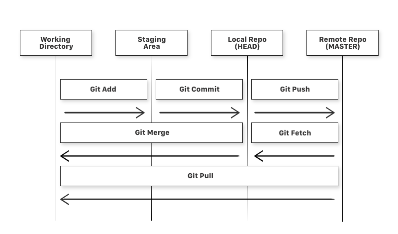

# 第一支Flutter程式
## 建置
1. 註冊 Github 帳號並加入至 [smartman-tw](https://github.com/smartman-tw) 組織。
   > 確保你可以看到 [課程存放庫](https://github.com/smartman-tw/flutter-training)。 
2. 請參考 [Flutter 安裝](https://flutter.dev/docs/get-started/install) 完成環境設定。

## 名詞
### Flutter
- **Flutter**: Google 開發的跨平台框架，可以用一套程式碼開發 iOS 和 Android 應用程式。
- **Dart**: Flutter 使用的程式語言。
- **VS Code**: Visual Studio Code，一個由 Microsoft 開發的程式碼編輯器，是一種IDE。
- **IDE**: Integrated Development Environment，整合開發環境。
- **widget**: Flutter 應用程式的基本元素，用來建構應用程式的介面。
- **package**: 用來封裝程式碼的套件，可以用來分享程式碼。
- **pubspec.yaml**: Flutter 專案的設定檔，用來設定專案的相依套件。
- **main.dart**: Flutter 應用程式的進入點，程式碼從這裡開始執行。
- **hot reload**: 在不重啟應用程式的情況下，即時更新程式碼。
- **stateful widget**: 有狀態的 widget，可以在 widget 中儲存狀態。
- **stateless widget**: 無狀態的 widget，不會在 widget 中儲存狀態。
  
### 版本控制
- **Git**: 一個版本控制系統，可以用來追蹤程式碼的變更。
- **GitHub**: 程式碼存放庫，可以用來儲存程式碼並與他人合作。
- **Repository**: 存放程式碼的地方。
- **Branch**: 存放庫中的分支，可以用來分開不同的功能或版本。
- **Commit**: 存放庫中的提交，可以用來記錄程式碼的變更。
- **Push**: 將本地端的提交推到遠端存放庫。
- **Pull Request**: 用來合併分支的請求。
- **Merge**: 合併分支。
- **Fork**: 複製存放庫。
- **Clone**: 複製存放庫到本地端。
- **Pull**: 從遠端存放庫拉取最新的程式碼。
- **Fetch**: 從遠端存放庫拉取最新的分支。
### Git 操作關聯圖

### VS Code
- **terminal**: 終端機，可以在 VS Code 中執行指令。
- **command palette**: 命令面板，可以在 VS Code 中執行指令。
- **file explorer**: 檔案總管，可以在 VS Code 中瀏覽檔案。
- **source control**: 版本控制，可以在 VS Code 中管理程式碼的變更。
- **extensions**: 擴充功能，可以在 VS Code 中安裝擴充功能。

## VS Code 快捷鍵
- `Ctrl+Shift+P`: 開啟命令面板。
- `Ctrl+P`: 開啟檔案。
- `Ctrl+點擊`: 跳到定義。
- `Ctrl+~`: 開啟終端機。
> 更多關於使用 VS Code 開發Flutter的建議請參考 [VSCode Shortcuts by Andrea](https://codewithandrea.com/articles/vscode-shortcuts-extensions-settings-flutter-development/)。

## Q&A
1. Q: 分支之間要如何合併?   
   A: Source Control > 更多選項 (...) > Branches > Merge > 選擇要合併的分支。  
2. Q: 如何退回到過去的版本? 要如何管理?  
   A: 可以，Source Control > 更多選項 (...) > Commit > Undo Last Commit。培養 commit 頻繁的習慣可以追蹤變動歷程。
3. Q: 能不能移除過去以前的某一個 commit?  
   A: Source Control > GITLENS > 選擇要移除的 commit > 選擇 revert。
4. Q: 如何檢視Git log輸出?  
   A: 開啟 terminal (`Ctrl+~`) > 切換到 OUTPUT 頁面 > 下拉選單選擇 Git。
