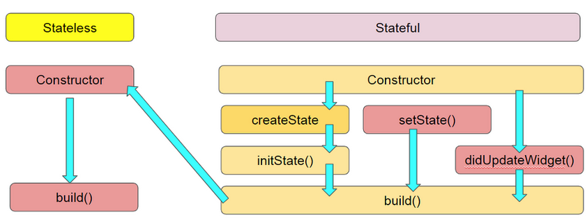

# 使用套件、生命週期
> 管理套件、widget的生命週期

## StatefulWidget的生命週期
- `initState()`: 當 widget 被建立時會被呼叫。(只會被呼叫一次)
- `didUpdateWidget()`: 當 widget 參數改變時會被呼叫。(需要根據參數改變widget狀態時需override)
- `build()`: 當任何狀態有改變時會被呼叫。(setState、initState、didUpdateWidget都會被觸發)
- `dispose()`: 當 widget 被移除時會被呼叫。(有使用任何controller需要再這裡釋放)

## 使用套件 (Packages)
請參考官方說明 [Using Packages](https://docs.flutter.dev/packages-and-plugins/using-packages)
## 套件安裝三種方式
> 這裡以安裝`faker`套件為例。前往 [pub.dev](https://pub.dev/)並搜尋faker。
1. 修改`pubspec.yaml`檔案後按存檔:
    ```yaml
    dependencies:
        flutter:
            sdk: flutter
        faker: ^2.2.0
    ```
2. 透過 terminal 中執行:
    ```bash
    flutter pub add faker
    ```
3. 透過命令面板(command palette)：在 VS Code 按下 `Ctrl+Shift+P` > 輸入 `Add dependency` > 輸入 `faker` 後按下 Enter。


## 使用圖片
[Add assets and images](https://flutter.dev/docs/development/ui/assets-and-images)