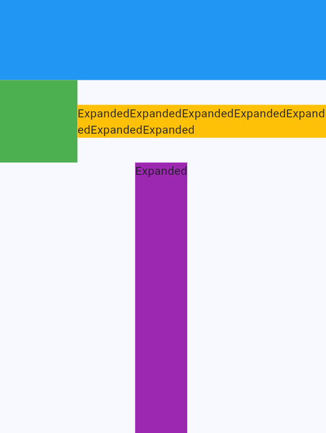

# 如何排版?
> 水平、垂直、滾動、重疊等排版技巧

更多請參考官方文件 [Flutter Layout](https://docs.flutter.dev/ui/layout)。

| Widget / Keyword              | 用途             | 常用參數                                                                          |
| ----------------------------- | ---------------- | --------------------------------------------------------------------------------- |
| `Row`                         | 水平排列         | `mainAxisAlignment` (左右隊齊), `crossAxisAlignment` (上下隊齊), `spacing` (間距) |
| `Column`                      | 垂直排列         | `mainAxisAlignment` (上下隊齊), `crossAxisAlignment` (左右隊齊), `spacing` (間距) |
| `ListView`                    | 滾動排列         | `scrollDirection` (滾動方向)                                                      |
| `Stack`                       | 重疊排列         | `alignment`                                                                       |
| `Wrap`                        | 自動換行排列     | `alignment`                                                                       |
| `Expanded`                    | 自動填滿剩餘空間 | `flex`                                                                            |
| `SingleChildScrollView`       | 單一子元件滾動   | `scrollDirection` (滾動方向)                                                      |
| `Spacer`                      | 自動填滿剩餘空間 |                                                                                   |
| `MediaQuery.of(context).size` | 取得螢幕尺寸     |                                                                                   |
| `Positioned`                  | Stack中定位      | `top`, `bottom`, `left`, `right`                                                  |
> 若要使用 Flutter 預設的 tab 可以參考 [Flutter Tab](https://docs.flutter.dev/cookbook/design/tabs)
## Expanded範例
`Expanded` 通常會放在 `Row` 或 `Column` 中，用來填滿剩餘的主軸(main axis)空間。以下圖為例:



* 黃色的容器被 `Expanded` 包覆，並且放置於 `Row` 中，所以黃色容器會填滿剩餘的水平寬度。
* 紫色的容器被 `Expanded` 包覆，並且放置於 `Column` 中，所以紫色容器會填滿剩餘的垂直高度。  

以下是刻出上圖的程式碼:
```dart
return Scaffold(
      body: Column(
        children: [
          Container(color: Colors.blue, height: 100),
          Row(
            children: [
              Container(color: Colors.green, height: 100, width: 100),
              Expanded(
                child: Container(
                  color: Colors.amber,
                  child: Text(
                    'ExpandedExpandedExpandedExpandedExpandedExpandedExpanded',
                  ),
                ),
              ),
            ],
          ),
          Expanded(
            child: Container(color: Colors.purple, child: Text('Expanded')),
          ),
        ],
      ),
    );
```
> 留意如果`Expanded`務必要放到`Column`或`Row`中，否則會報錯。更多請參考[Expanded](https://api.flutter.dev/flutter/widgets/Expanded-class.html)
## 常見問題:
[Renderbox overflowed](https://stackoverflow.com/questions/49480051/flutter-dart-exceptions-caused-by-rendering-a-renderflex-overflowed)
## 練習
請複製以下UberEats首頁的畫面:
>圖片部分可以使用icons或色塊取代

