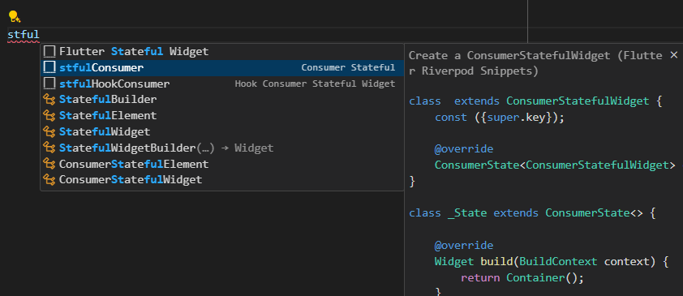

# Riverpod
[官方網站](https://riverpod.dev/)
> 同為 Riverpod 的開發者設計，在 Riverpod 以前另有 [Provider](https://pub.dev/packages/provider) 套件。可以參考 [Flutter 官方網站的簡易套件管理說明](https://pub.dev/packages/provider) 如何使用 Provider。
## 安裝
在 Terminal 輸入以下指令
```bash
flutter pub add flutter_riverpod
```
## 使用 Riverpod
### 事前準備
* 在 `main.dart` 中加入 `ProviderScope`
```dart
import 'package:flutter_riverpod/flutter_riverpod.dart';
void main() {
    runApp(ProviderScope(child: MyApp()));
}
```
### 建立一個 Provider
```dart
import 'package:flutter_riverpod/flutter_riverpod.dart';
final typeProvider = Provider<List<String>>((ref) {
  return // ...回傳資料 (List<String>)
});
```
### 使用 Provider
* 在 VS Code 安裝 Flutter Riverpod Snippets extension，就可以透過輸入`stlessConsumer` > 按下 tab 鍵快速建立一個 `ConsumerWidget`或是 `stfulConsumer` 來建立一個 `ConsumerStatefulWidget`。

    > 原本 `StatefulWidget` 對應為 `ConsumerStatefulWidget`、`StatelessWidget` 對應為 `ConsumerWidget`。
* 使用 `ref.watch` 來監聽 Provider 的狀態。
```dart
class FilterScreen extends ConsumerWidget {
  const FilterScreen({super.key});

  @override
  Widget build(BuildContext context, WidgetRef ref) {
    // 取得所有的類型
    final types = ref.watch(typeProvider);
    return Scaffold(
      // ...省略程式碼
    );
  }
}

```
### 改變 Provider 的狀態
若資料很簡單，可以使用 `StateProvider` 來建立一個可以改變狀態的 Provider。
```dart
// 紀錄搜尋字串
final searchTermProvider = StateProvider<String>((ref) => '');
```
* 使用 `ref.read` 來取得 Provider 的實例，並透過 `notifier` 來改變 Provider 的狀態。
```dart
TextField(
    decoration: InputDecoration(
        hintText: '搜尋',
    ),
    onChanged: (value) {
        // 改變搜尋字串
        ref.read(searchTermProvider.notifier).state = value;
    },
)
```
若資料或邏輯較複雜，可以使用 `StateNotifier` 來建立一個可以改變狀態的 Provider。
定義 `StateNotifier` 類別，並透過 `StateNotifierProvider` 來建立一個可以改變狀態的 Provider。
> 什麼時候用 `StateNotifierProvider`? 當資料的格式是一個較複雜的型態如一個類別、包含額外的初始化邏輯或是需要進行較複雜的資料處理時。
* 建立一個類別並 extends `StateNotifier`。`StateNotifier` 是一個泛型 (generic) 類別，可以在`<>`中指定要資料型態。`super` 則是呼叫父類別的建構子。以下的例子中，`super({})` 是呼叫父類別的建構子，並傳入一個空的 Map。

* 改變狀態的是清除舊的資料，並重新建立新的資料。而不是直接修改資料。要更改資料，可以取得 `state` 並透過 `state =` 來改變資料。
* 最後透過 `StateNotifierProvider` 來建立一個可以改變狀態的 Provider。跟 Provider 類似，`StateNotifierProvider` 接受一個方法，並回傳一個 `StateNotifier` 的實例。同時 `StateNotifierProvider` 也是一個泛型類別，可以在 `<>` 中指定要資料型態。但需要指定兩個型態，第一個是 `StateNotifier` 的型態，第二個是 `StateNotifier` 的 `state` 的型態。
```dart
// 建立 StateNotifier 類別，型態為 Map<String, bool>
class SelectedTypes extends StateNotifier<Map<String, bool>> {
  late List<String> types;
  SelectedTypes(Ref ref) : super({}) {
    types = ref.watch(typeProvider);
    state = {for (var type in types) type: true};
  }

  void toggle(String type, bool selected) {
    state = {...state, type: selected};
  }

  void clear() {
    state = {};
  }

  void selectAll() {
    state = {for (var type in types) type: true};
  }
}
// 建立 StateNotifierProvider，型態有兩個，第一個是 StateNotifier，第二個是 Map<String, bool>
final selectedTypesProvider =
    StateNotifierProvider<SelectedTypes, Map<String, bool>>((ref) {
  return SelectedTypes(ref);
});
```
> `...` 是展開運算子 (Spread operator)，可以將 List 展開成多個元素。如 `[...[1, 2], 3]` 會變成 `[1, 2, 3]` 或是展開 Map 成多個 key-value 對。如 `{...{'a': 1, 'b': 2}, 'c': 3}` 會變成 `{'a': 1, 'b': 2, 'c': 3}`。

* 使用 `ref.read` 來取得 Provider 的實例，並透過 `notifier` 來呼叫 Provider 中的方法。
```dart
// ...省略程式碼
class _PokemonDetailScreenState extends ConsumerState<PokemonDetailScreen> {
  @override
  Widget build(BuildContext context) {
    return Scaffold(
      appBar: AppBar(
        title: Text(widget.pokemon.name),
        actions: [
          IconButton(
            icon: Icon(Icons.favorite),
            onPressed: () {
              // 切換是否為最愛
              ref.read(favoriteProvider.notifier).toggle(widget.pokemon);
            },
            // 依照是否為最愛來改變顏色
            color: ref
                    .watch(favoriteProvider)
                    .where((p) => p.id == widget.pokemon.id)
                    .isNotEmpty
                ? Colors.red
                : null,
          ),
        ],
      ),
      // ...省略程式碼
    );
  }
}

```
### 利用 Provider 的資料初始化 Widget

```dart
class SelectedTypes extends StateNotifier<Map<String, bool>> {
  // 紀錄所有的類型
  late List<String> types;
  SelectedTypes(Ref ref) : super({}) {
    // 取得所有的類型
    types = ref.watch(typeProvider);
    // 初始化狀態
    state = {for (var type in types) type: true};
  }

  void toggle(String type, bool selected) {
    state = {...state, type: selected};
  }

  void clear() {
    state = {};
  }

  void selectAll() {
    state = {for (var type in types) type: true};
  }
}

```
> * `late` 是延遲初始化，可以在建構子中初始化變數。在這個例子中，`types` 是一個 List，可以在建構子中初始化。
> * 留意這裡不能夠 `state[type] = selected` 來改變狀態。因為狀態的改變不會觸發重新建構，所以 UI 不會更新。必須透過 `state = ` 來改變狀態。
> * `Map` 是一個 key-value 的資料結構，可以透過 key 來取得 value。在這個例子中，`state` 是一個 `Map`，key 是類型的名稱，value 是是否選擇。`{for (var type in types) type: true}` 是一個 Map 的建立方式，`for (var type in types)` 會將 `types` 中的每一個元素取出來，並將元素指定為 `type`。`type: true` 是將 `type` 作為 key，`true` 作為 value 加入到 Map 中。


### 當一個 Provider 需要 (依賴) 另一個 Provider 的狀態
可以透過 `ref` 來取得其他 Provider 的狀態。
```dart
final typeProvider = Provider<List<String>>((ref) {
  final pokemons = ref.watch(pokemonProvider);

  return pokemons.when(
    data: (pokemons) => pokemons
        .expand((pokemon) => pokemon.types)
        .toSet()
        .toList(), // 取得所有的類型並去除重複
    loading: () => [],
    error: (err, stack) => [],
  );
});
```
> * 範例中 `pokemons` 是一個 `AsyncValue`，可以透過 `when` 來取得資料、錯誤或是載入中的狀態。
> * `expand` 是將 List 展開成多個元素，例如 `[[1, 2], [3, 4]]` 會變成 `[1, 2, 3, 4]`。程式碼為 `[[1, 2], [3, 4]].expand((list) => list)`。
> * `toSet` 是將 List 轉換成 Set，Set 是一個不重複的集合，例如 `[1, 2, 3, 3].toSet()` 會變成 `{1, 2, 3}`。
> * 最後透過 `toList` 將 Set 轉換成 List。
```dart
// 篩選後的寶可夢資料
final filteredPokemonProvider = FutureProvider<List<Pokemon>>((ref) async {
  // 取得所有寶可夢資料
  final pokemons = await ref.watch(pokemonProvider.future);
  // 取得選擇的類型
  final selectedTypes = ref.watch(selectedTypesProvider);
  // 取得搜尋字串
  final searchTerm = ref.watch(searchTermProvider);
  // 篩選寶可夢
  return pokemons.where((pokemon) {
    // 檢查是否符合類型
    final matchesTypes =
        pokemon.types.any((type) => selectedTypes[type] ?? false);
    // 檢查是否符合搜尋字串
    final matchesSearchTerm = pokemon.name.contains(searchTerm);
    return matchesTypes && matchesSearchTerm;
  }).toList();
});
```
### 相關連結
* [下拉更新](https://riverpod.dev/docs/case_studies/pull_to_refresh)
* [避免事項](https://riverpod.dev/docs/essentials/do_dont)
* [Riverpod 2.0 新語法](https://riverpod.dev/docs/migration/from_state_notifier)
### 不同的 Provider 整理
| Provider | 用途 |
| -------- | ---- |
| Provider | 單純提供資料 |
| StateProvider | 提供資料 + 單純對單一值修改 |
| FutureProvider | 單純提供一個非同步的資料 |
| StateNotifierProvider | 提供較為複雜的資料 + 可以撰寫不同的修改邏輯 (side effects) |

### 資料型態
| 資料型態 | 用途 | 範例 |
| -------- | ---- | ---- |
| List | 一個有序的集合 | `[1, 1, 2, 3]` |
| Set | 一個沒有重複的集合 | `{1, 2, 3}` |
| Map | 一個 key-value 的集合 | `{'a': 1, 'b': 2}` |
### 資料處理
| 方法 | 用途 | 範例 | 結果 |
| ---- | ---- | ---- | ---- |
| where | 篩選元素 | `[1, 2, 3].where((n) => n > 2)` | `[3]` |
| contains | 檢查是否包含某個元素 | `'hello'.contains('he')` | `true` |
| toSet | 將 List 轉換成 Set | `[1, 2, 3, 3].toSet()` | `{1, 2, 3}` |
| toList | 將 Set 轉換成 List | `{1, 2, 3}.toList()` | `[1, 2, 3]` |
| any | 檢查是否有任何一個元素符合條件 | `[1, 2, 3].any((n) => n > 2)` | `true` |
| expand | 將 List 展開成多個元素 | `[[1, 2], [3, 4]].expand((list) => list)` | `[1, 2, 3, 4]` |
| `...` | 展開運算子 | `{...{'a': 1, 'b': 2}, 'c': 3}` | `{'a': 1, 'b': 2, 'c': 3}` |
