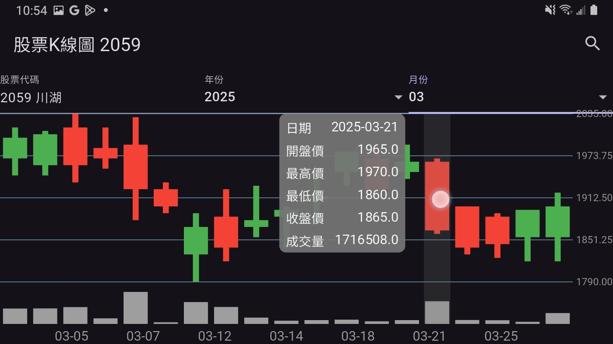

# 網路
> API串接、序列化資料、專題規格範例說明
### 命名風格
建議遵守官方的命名風格，以利程式碼的閱讀與維護。
[Dart 官方命名風格](https://dart.dev/effective-dart/style)
| 類型             | 命名風格                               | 範例                                                    |
| ---------------- | -------------------------------------- | ------------------------------------------------------- |
| 檔案、資料夾     | lower_case_with_underscores (底線區隔) | `my_file.dart`、`my_widget_folder`                      |
| 類別             | UpperCamelCase (第一個字大寫)          | `class MyClass`                                         |
| 方法、變數、參數 | lowerCamelCase (第一個小寫)            | `addPerson()`、`var person = Person(name: 'John Joe');` |

### 非同步
[Dart 官方非同步](https://dart.dev/libraries/async/async-await)

非同步的精神其實就是當某的動作正在執行時，程式還可以進行其他動作。例如程式在等待網路回傳資料時，程式可以繼續執行其他動作，而不是畫面卡在那裏去僅僅等待網路回傳資料。

底下範例是一個簡單的非同步程式碼，程式在取得網路資料時，畫面上顯示轉圈圈，當資料取得後，轉圈圈消失。
> * Future 是 Dart 中代表非同步操作的物件。Future 是泛型，可以指定回傳的資料型態。(在<>中指定)
> * async 跟 await 組合需要同時出現 (或是兩個都不用直接用then)
> * try-catch-finally 是一個錯誤處理的結構，當程式發生錯誤時，會進入 catch 區塊，finally 區塊則是不管有沒有錯誤都會執行的區塊。(跟C#一樣!)
```dart
// ...省略程式碼 (建立一個 StatefulWidget)
bool isLoading = false; // 是否正在載入
String data = ''; // 資料
String error = '';

@override
void initState() {
    super.initState();
    fetchData(); // 初始化時取得資料
}

Future<void> fetchData() async {
    setState(() => isLoading = true); // 開始載入
    setState(() => error = ''); // 清空錯誤
    try {
        // 模擬等待
        await Future.delayed(Duration(seconds: 2));
        // 模擬發生錯誤
        if (DateTime.now().second % 2 == 0) {
            throw Exception('隨機錯誤');
        }
        setState(() => data = '資料來了'); // 模擬取得資料
    } catch (e) {
        setState(() => error = e.toString()); // 顯示錯誤
    } finally {
        setState(() => isLoading = false); // 結束載入
    }
}

@override
Widget build(BuildContext context) {
  return Scaffold(
    body: isLoading // 如果正在載入
            ? Center(child: CircularProgressIndicator()) // 顯示載入中
            : Column(
                children: [
                  if (error.isEmpty) Text(data), // 顯示資料
                  if (error.isNotEmpty) Text(error), // 顯示錯誤
                  ElevatedButton(
                    onPressed: fetchData, // 點擊時取得資料
                    child: Text('取得資料'),
                  ),
                ],
              ),
  );
}

```
或是使用Flutter內建有個叫做 `FutureBuilder` 的Widget，可以方便處理非同步的邏輯與元件顯示。
> 雖然 `FutureBuilder` 減少了一些程式碼 (不用再額外建立 isLoading 與錯誤訊息)，但是由於 `FutureBuilder` 是一個建立在 build() 底下的 widget，因此每次 build() 都會重新建立一次 `FutureBuilder` 進而導致效能問題。

> 此外，更常見的處理方式為透過狀態管理將非同步邏輯狀態包成一個類別，才有更多選擇去進一步去細部處理資料的取得邏輯與狀態。(如自訂錯誤訊息、自訂重新取得資料、自訂資料轉換邏輯等操作)

```dart
//...省略程式碼
Future<String> fetchData() async {
    // 模擬等待
    await Future.delayed(Duration(seconds: 2));
    // 模擬發生錯誤
    if (DateTime.now().second % 2 == 0) {
        throw Exception('隨機錯誤');
    }
    // 模擬取得資料
    return '資料來了';
}

@override
Widget build(BuildContext context) {
  return Scaffold(
    body: Center(
      // 使用 FutureBuilder 來處理非同步
      child: FutureBuilder<String>(
        // 未來: 取得資料
        future: fetchData(),
        builder: (context, snapshot) {
          // 判斷狀態
          if (snapshot.connectionState == ConnectionState.waiting) {
            return CircularProgressIndicator(); // 顯示轉圈圈
          } else if (snapshot.hasError) {
            return Text('錯誤: ${snapshot.error}'); // 顯示錯誤
          } else {
            return Text('回傳: ${snapshot.data}'); // 顯示資料
          }
        },
      ),
    ),
  );
}
```

### 練習
> 概念: API串接、非同步程式設計、自動完成輸入、套件使用

底下我們來利用[臺灣證券交易所](https://www.twse.com.tw/zh/trading/historical/stock-day.html)的API跟套件 [`http`](https://pub.dev/packages/http)來串接網路資料與[`interactive_chart`](https://pub.dev/packages/interactive_chart)以顯示K線圖。
範例結果如下:

#### 取得股票資料: 
`https://www.twse.com.tw/rwd/zh/afterTrading/STOCK_DAY?date={yyyyMMdd}&stockNo={股票代碼}&response=json`
#### 股票資料回傳格式
```json
{
  "stat": "OK",
  "date": "20250327",
  "title": "114年03月 2002 中鋼             各日成交資訊",
  "fields": [
    "日期",
    "成交股數",
    "成交金額",
    "開盤價",
    "最高價",
    "最低價",
    "收盤價",
    "漲跌價差",
    "成交筆數"
  ],
  "data": [
    [
      "114/03/03",
      "77,384,598",
      "1,842,489,852",
      "23.60",
      "24.10",
      "23.35",
      "24.00",
      "-0.35",
      "27,866"
    ]
  ]
}

```
#### 股票代碼API 
`https://www.twse.com.tw/rwd/zh/api/codeQuery?query={搜尋字串}`
#### 股票代碼回傳格式
```json
{
  "query": "201",
  "suggestions": [
    "2010\t春源",
    "2011\t彥武",
    "2012\t春雨",
    "2013\t中鋼構",
    "2014\t中鴻",
    "2015\t豐興",
    "2016\t名佳利",
    "2017\t官田鋼",
    "2018\t峰安",
    "2019\t桂宏",
    "2011A\t彥甲特",
    "2013A\t中構特",
    "2014A\t燁隆特",
  ]
}

```