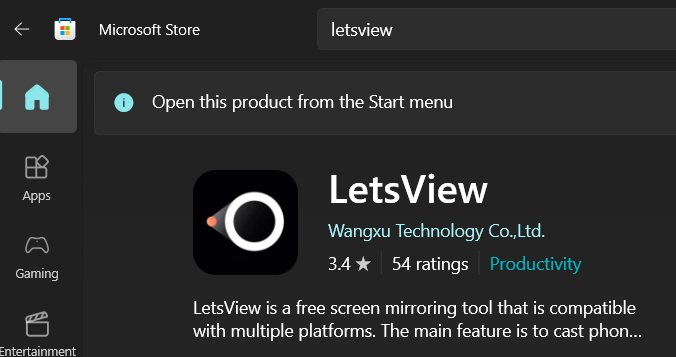
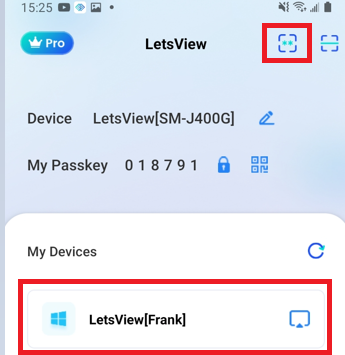

# Demo Info
以下是一些Demo的事項:
- [ ] 請確保您的專案能在實體手機上運行，並且能夠透過USB連接到電腦上進行Demo。投影程式請參考 [LetsView](#LetsView)。
- [ ] Demo的內容方式不限，基本上是進行實際操作，可以在Demo開場先說明專案的主題實作動機與靈感，然後進行實際操作。Demo的時間大約是15-20分鐘。可自行調整時間。
### LetsView
要將手機上的畫面投影到電腦上，可以使用 [LetsView](https://apps.microsoft.com/detail/xp9crzqdcj0cc6?hl=en-us&gl=US)。

使用步驟: 
1. 在手機上從Google Play商城下載 [LetsView](https://play.google.com/store/apps/details?id=com.apowersoft.letsview&hl=en-US)。
2. 在電腦上下載 [LetsView](https://apps.microsoft.com/detail/xp9crzqdcj0cc6?hl=en-us&gl=US)。
3. 手機跟電腦必須要使用同個Wi-Fi網路。
4. 電腦上開啟QRCode並在手機上使用掃描功能掃描此QRCode以利連線。
   
