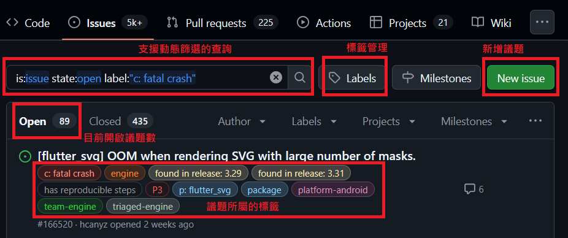

# GitHub 議題功能

GitHub Issues 是 GitHub 提供的一個功能，用於追蹤專案的問題、錯誤，以及功能請求與討論。以下是 Issues 的主要功能：

- **集中式議題追蹤管理**：方便開發者和使用者查看與管理。
- **標籤與篩選**：快速找到相關議題。[如何篩選](https://docs.github.com/en/issues/tracking-your-work-with-issues/using-issues/filtering-and-searching-issues-and-pull-requests)
- **指派與分配**：可以在議題中標記相關人員，讓他們收到通知。
- **評論與討論**：支援 Markdown 語法與檔案上傳。
  - **檔案上傳**：[上傳檔案](https://docs.github.com/en/get-started/writing-on-github/working-with-advanced-formatting/attaching-files)到議題中，方便討論與參考。
- **與 Commit 關聯**：可以在議題中引用 Commit，方便追蹤問題來源。使用 Commit 的 SHA 值會自動轉為連結。[加入參考方式](https://docs.github.com/en/get-started/writing-on-github/working-with-advanced-formatting/autolinked-references-and-urls#commit-shas)
- **與程式碼關聯**：[關聯到程式碼](https://docs.github.com/en/get-started/writing-on-github/working-with-advanced-formatting/creating-a-permanent-link-to-a-code-snippet)
- **通知與更新**：當議題有新的評論或狀態變更時，相關人員會收到通知，方便即時了解議題進展。

> [!TIP]
> [Flutter 在 GitHub](https://github.com/flutter/flutter/issues) 上也有許多議題（超過 5000 筆）。Issues 不一定是錯誤或 Bug，也可能是功能請求或建議。

[如何使用 GitHub Issues](https://docs.github.com/en/issues/tracking-your-work-with-issues/configuring-issues/quickstart)

